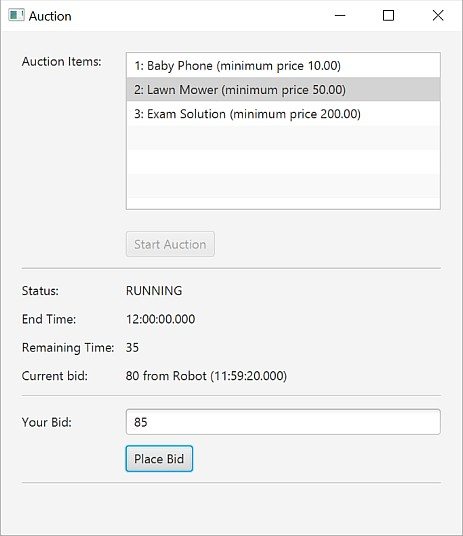

# Schlussprüfung OOP2 FS19 - Programmieraufgabe

## Beschreibung

Es soll eine Auktionsapplikation entwickelt werden, die wie folgt funktioniert:
- Aus einem Katalog kann ein Objekt ausgewählt und damit eine Auktion gestartet werden.
- Nach dem Start wird der aktuelle Zustand der Auktion angezeigt und es können Gebote für das Objekt platziert werden.
- Gleichzeitig gibt es einen automatischen Bieter, der ebenfalls Gebote platziert.
- Jede Auktion dauert eine feste Zeit, danach können keine Gebote mehr platziert werden.

Der folgende Screenshot zeigt das GUI der Applikation:

## Design

Die Applikation soll gemäss folgendem Klassendiagramm implementiert werden, das im Sinne einer Spezifikation *verpflichtend* ist:

**Hinweis**: Der Kreis mit dem Kreuz bedeutet, dass `HumanBidder` eine innere Klasse von `AuctionController` ist.

## Anweisungen

Als Vorlage enthält dieses Repository ein lauffähiges Programm, welches eine Teilimplementierung der Applikation ist (grau-schattierte Klassen). Lösen Sie die untenstehenden Aufgaben. Für die Bewertung sind folgende Punkte relevant:
- Funktionalität gemäss Aufgabenstellung
- Einhaltung des vorgegebenen Designs (Klassendiagramm)
- Verwendung von Streams und Lambda-Ausdrücken (wo möglich)
- Code-Qualität (Programmierrichtlinien, Clean Code)
- Kompilierbarkeit des Codes

Committen und pushen Sie mindestens *alle 15 Minuten* den aktuellen Stand Ihres Projekts. Diese Zwischenstände dienen lediglich der Nachvollziehbarkeit, für die Bewertung ist ausschliesslich der letzte Commit relevant. Commits nach Ende der Prüfungszeit werden nicht berücksichtigt.

## 1. Auktion (30 Punkte)

- Implementieren Sie die Klasse `Auction`, welche das Auktionsobjekt (`item`), die Auktionsdauer (`duration`) in Sekunden, den Status (`status`), die Endzeit (`endTime`), das aktuelle Gebot (`currentBid`) und die Liste der Bieter (`bidders`) enthält. Das Auktionsobjekt und die Auktionsdauer werden im Konstruktor übergeben.
- Neben den üblichen Getter-Methoden soll die Klasse `Auction` folgende Methoden anbieten:
	- Die Methode `getRemainingTime` gibt die verbleibende Zeit in Sekunden zurück (`null`, wenn die Auktion nicht läuft).
	- Mit der Methode `register` kann sich ein Bieter bei einer Auktion registrieren.
	- Die Methode `start` startet eine Auktion (wenn sie nicht schon am Laufen oder beendet ist) und bestimmt aufgrund der Auktionsdauer die Endzeit.
	- Die Methode `end` beendet eine Auktion (wenn sie am Laufen ist).
	- Mit der Methode `bid` kann ein Bieter ein Gebot platzieren. Dabei wird zunächst geprüft, ob die Endzeit der Auktion erreicht ist und wenn ja, die Auktion beendet. Dann werden folgende Vorbedingungen geprüft und bei Nicht-Erfüllung eine `InvalidBidException` mit entsprechender Fehlermeldung geworfen:
		- Ist die Auktion am Laufen?
		- Ist das Gebot mindestens so hoch wie der minimale Preis des Objekts?
		- Ist das Gebot höher als das aktuelle Gebot (wenn vorhanden)?
- Beachten Sie, dass die Methoden `start`, `end` und `bid` jeweils den Status der Auktion anpassen und alle registrierten Bieter über die Methode `auctionChanged` benachrichtigen.
- Mit dem JUnit-Test `AuctionTest` können Sie die Grundfunktionalität der Klasse `Auction` prüfen.

**Hinweis:**
Die Endzeit der Auktion ist vom Typ `java.time.LocalTime`, welche eine Uhrzeit repräsentiert (siehe [Java API-Dokumentation](https://docs.oracle.com/javase/8/docs/api/java/time/LocalTime.html)). Besonders nützlich sind die Methoden `now`, `plusSeconds`, `until` und `isAfter`.

## 2. Bieter (15 Punkte)

- Ergänzen Sie die Klasse `Bidder` um eine Referenz auf die Auktion, welche im Konstruktor übergeben wird und mit welcher sich der Bieter bei der Auktion selbst registriert. Fügen Sie zudem die abstrakte Methode `auctionChanged` hinzu.
- Leiten Sie die Klasse `RobotBidder` von der Klasse `Bidder` ab. Überschreiben Sie die Methode `auctionChanged` so, dass bei Vorhandensein eines fremden aktuellen Gebots ein neues Gebot in der Auktion platziert wird. Dabei soll das bestehende Gebot jeweils um einen konstanten Betrag (`increment`) erhöht werden, aber nur bis zu einem bestimmten Höchstbetrag (`limit`). Der Erhöhungsbetrag und der Höchstbetrag werden im Konstruktor übergeben.

## 3. Grafische Benutzeroberfläche (30 Punkte)

- Fügen Sie in der FXML-Datei und in der Klasse `AuctionController` JavaFX-Controls hinzu
    - für den Zustand der Auktion (`Status`, `End Time`, `Remaining Time` und `Current Bid`)
    - für den menschlichen Bieter (`Your Bid`)
- Trennen Sie die einzelnen GUI-Bereiche durch Linien so, wie im obigen Screenshot dargestellt. Fehlermeldungen, z.B. wenn ein Bieter eine der Vorbedingungen der Methode `bid` nicht einhält, sollen zuunterst in einer separaten Zeile angezeigt werden.
- Implementieren Sie innerhalb der Klasse `AuctionController` die Klasse `HumanBidder`, welche von der Klasse `Bidder` abgeleitet ist. Die Methode `auctionChanged` soll jeweils den Zustand der Auktion aktualisieren. 
- Vervollständigen Sie die Methode `startAuction`, welche als Callback für den `Start`-Knopf dient. Ihre Aufgaben sind:
	- eine Auktion mit dem ausgewählten Auktionsobjekt und einer Dauer von 60 Sekunden erzeugen
	- einen `HumanBidder` erzeugen
    - einen `RobotBidder` mit Inkrement 1 und dem Fünffachen des minimalen Preises als Höchstebetrag erzeugen
	- die Auktion starten
- Implementieren Sie eine Callback-Methode für den `Place Bid`-Knopf. Sie prüft, ob die Eingabe eine Zahl ist und platziert mithilfe der `bid`-Methode der Auktion ein entsprechendes Gebot. Ist die Eingabe keine Zahl oder schlägt das Platzieren des Gebots fehl, so wird eine entsprechende Fehlermeldung angezeigt.
- Aktivieren oder deaktivieren Sie die Knöpfe `Start Auction` und `Place Bid` dem aktuellen Status der Auktion entsprechend.

## 4. Automatischer Auktionsablauf (15 Punkte)

- Implementieren Sie in der Klasse `Auction` das Interface `Runnable`. Die zugehörige `run`-Methode soll jede Sekunde alle Bieter benachrichtigen so, dass diese die verbleibende Zeit aktualisieren können. Bei Erreichen der Endzeit soll der Thread die Auktion automatisch beenden und terminieren.
- Erzeugen Sie beim Starten der Auktion einen enstprechenden Thread und starten Sie ihn.
- Überlegen Sie sich, ob eine Synchronisation notwendig ist und setzen Sie diese nötigenfalls um.

## 5. Persistenter Katalog (10 Punkte)

- Ersetzen Sie die Implementierung der Methode `loadCatalog` der Klasse `CatalogDAO` so, dass die Katalogdaten mittels JAXB aus der XML-Datei `catalog.xml` gelesen werden.
- Annotieren Sie dazu die Klassen `AuctionCatalog` und `AuctionItem` mit passenden JAXB-Annotationen.
